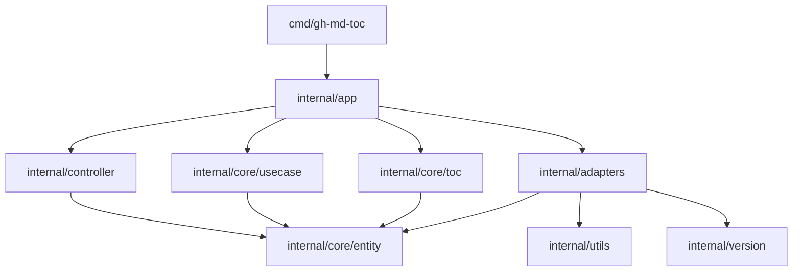
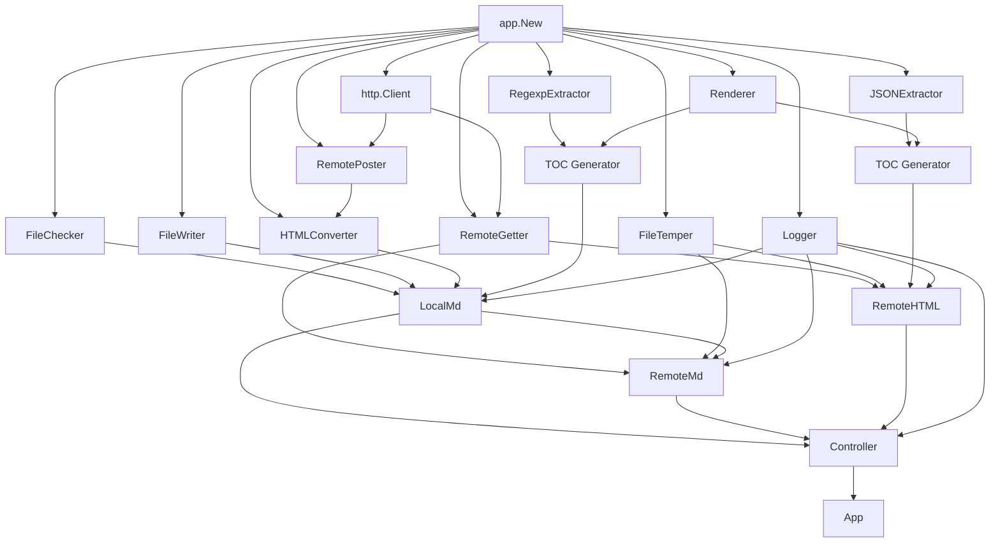

# Architecture

## Overview

`gh-md-toc` is a command-line application that generates a Markdown table of contents for local Markdown files, remote raw Markdown files, and GitHub document pages.

The project uses explicit dependency injection and package boundaries instead of inheritance. Go does not have classes, so the hierarchy below describes packages, structs, interfaces, ownership, and runtime calls.

The main architectural layers are:

1. `cmd/gh-md-toc` parses CLI options and starts the application.
2. `internal/app` is the composition root and presentation boundary.
3. `internal/controller` selects use cases, coordinates concurrency, and prints results.
4. `internal/core/usecase` implements document-processing workflows.
5. `internal/core/toc` contains the shared TOC generation rules.
6. `internal/core/entity` contains the core data types.
7. `internal/adapters` implements file, HTTP, GitHub, parsing, and logging operations.

## Clean and hexagonal architecture

The project is implemented in the style of Clean Architecture and hexagonal architecture. Business and application rules are kept separate from CLI, filesystem, HTTP, and GitHub-specific infrastructure.

The architectural roles are:

- `internal/core/entity`, `internal/core/toc`, and `internal/core/usecase` form the application core;
- `cmd/gh-md-toc` and `internal/controller` form the driving side that receives CLI input and invokes use cases;
- `internal/adapters` contains driven adapters for filesystem, HTTP, GitHub conversion and parsing, and logging;
- small interfaces declared by consumers act as ports between core workflows and concrete adapters;
- `internal/app` is the composition root that selects implementations and connects ports to adapters.

Dependencies point toward application rules. Core packages do not import CLI, controller, or adapter packages. Infrastructure details can therefore be replaced in tests or changed without moving their behavior into the core.

## Package hierarchy

```text
cmd/gh-md-toc
└── CLI parsing and process lifecycle
    └── internal/app
        ├── configuration and presentation
        ├── dependency construction
        ├── internal/controller
        │   └── input routing, concurrency, and result output
        ├── internal/core/usecase
        │   ├── localmd
        │   ├── remotemd
        │   └── remotehtml
        ├── internal/core/toc
        │   ├── Generator
        │   └── Renderer
        └── internal/adapters
            ├── filesystem adapters
            ├── HTTP adapters
            ├── GitHub HTML and JSON extractors
            └── logger

internal/core/entity
├── Heading
├── Toc
└── Type
```

## Dependency direction

The composition root knows all concrete implementations. Lower-level packages depend only on core types, standard library types, and small interfaces declared by their consumers.



Important dependency rules:

- `internal/core` does not import `internal/app`, `internal/controller`, or `internal/adapters`.
- `internal/controller` does not import concrete use case packages. It accepts the local `useCase` interface.
- use cases do not import concrete adapters. Each use case declares the interfaces it consumes.
- adapters do not own core workflow interfaces. They satisfy consumer interfaces implicitly.
- `internal/app` is allowed to import all application packages because it constructs the runtime object graph.

## Runtime object graph

`app.New` creates and connects the application objects. Shared instances are created once and passed to all consumers that need them.



The shared `http.Client` gives all remote operations the same timeout configuration. The shared `Renderer` gives both extraction paths the same TOC formatting behavior.

## Main types and responsibilities

| Package | Type | Responsibility |
|---|---|---|
| `internal/app` | `App` | Runs presentation logic before and after controller processing. |
| `internal/app` | `Config` | Holds execution, presentation, GitHub, and TOC settings. |
| `internal/app` | `PresentationConfig` | Controls header and footer visibility. |
| `internal/app` | `GitHubConfig` | Holds the GitHub token, API URL, and regexp layout version. |
| `internal/controller` | `Controller` | Selects a use case, runs document jobs, preserves output order, and aggregates errors. |
| `internal/core/usecase/localmd` | `LocalMd` | Validates a local file, converts Markdown through GitHub, and generates a TOC from returned HTML. |
| `internal/core/usecase/remotemd` | `RemoteMd` | Downloads raw Markdown to a temporary file and delegates processing to `LocalMd`. |
| `internal/core/usecase/remotehtml` | `RemoteHTML` | Downloads GitHub JSON data and generates a TOC through the JSON path. |
| `internal/core/toc` | `Generator` | Combines a heading extractor with the shared renderer. |
| `internal/core/toc` | `Renderer` | Applies depth, indentation, escaping, and link rules to headings. |
| `internal/core/entity` | `Heading` | Represents a parsed heading before Markdown rendering. |
| `internal/core/entity` | `Toc` | Represents the generated TOC as Markdown lines and prints it. |
| `internal/core/entity` | `Type` | Classifies an input as local Markdown, remote raw Markdown, or remote HTML. |
| `internal/adapters` | `HTMLConverter` | Sends local Markdown to the GitHub Markdown API. |
| `internal/adapters` | `RemotePoster` | Sends a file through the configured HTTP client. |
| `internal/adapters` | `RemoteGetter` | Downloads remote content through the configured HTTP client. |
| `internal/adapters` | `RegexpExtractor` | Extracts headings from GitHub-rendered HTML. |
| `internal/adapters` | `JSONExtractor` | Extracts headings from a GitHub JSON response. |
| `internal/adapters` | `FileChecker` | Checks whether a local file exists. |
| `internal/adapters` | `FileWriter` | Writes debug content to a file. |
| `internal/adapters` | `FileTemper` | Creates and removes temporary files. |
| `internal/adapters` | `Logger` | Enables structured logging only in debug mode. |

## Interface relationships

Interfaces are intentionally small and located next to the consuming code.

| Consumer | Interface | Implemented by |
|---|---|---|
| `app.App` | `app.Controller` | `*controller.Controller` |
| `controller.Controller` | `controller.useCase` | `*localmd.LocalMd`, `*remotemd.RemoteMd`, `*remotehtml.RemoteHTML` |
| `controller.Controller` | `controller.logger` | `*adapters.Logger` |
| `localmd.LocalMd` | `localmd.fileChecker` | `*adapters.FileChecker` |
| `localmd.LocalMd` | `localmd.fileWriter` | `*adapters.FileWriter` |
| `localmd.LocalMd` | `localmd.htmlConverter` | `*adapters.HTMLConverter` |
| `localmd.LocalMd` | `localmd.tocGrabber` | `*toc.Generator` |
| `localmd.LocalMd` | `localmd.logger` | `*adapters.Logger` |
| `remotemd.RemoteMd` | `remotemd.remoteGetter` | `*adapters.RemoteGetter` |
| `remotemd.RemoteMd` | `remotemd.markdownProcessor` | `*localmd.LocalMd` |
| `remotemd.RemoteMd` | `remotemd.fileTemper` | `*adapters.FileTemper` |
| `remotemd.RemoteMd` | `remotemd.logger` | `*adapters.Logger` |
| `remotehtml.RemoteHTML` | `remotehtml.remoteGetter` | `*adapters.RemoteGetter` |
| `remotehtml.RemoteHTML` | `remotehtml.tocGrabber` | `*toc.Generator` |
| `remotehtml.RemoteHTML` | `remotehtml.fileTemper` | `*adapters.FileTemper` |
| `remotehtml.RemoteHTML` | `remotehtml.logger` | `*adapters.Logger` |
| `toc.Generator` | `toc.HeadingExtractor` | `*adapters.RegexpExtractor`, `*adapters.JSONExtractor` |
| `adapters.HTMLConverter` | `adapters.remotePoster` | `*adapters.RemotePoster` |

These interfaces allow unit tests to replace each dependency with a small stub without requiring a shared ports package.

## Configuration hierarchy

```text
app.Config
├── Files []string
├── Serial bool
├── Debug bool
├── Presentation app.PresentationConfig
│   ├── HideHeader bool
│   └── HideFooter bool
├── GitHub app.GitHubConfig
│   ├── GHToken string
│   ├── GHUrl string
│   └── GHVersion string
└── TOC toc.Config
    ├── AbsolutePaths bool
    ├── StartDepth int
    ├── Depth int
    ├── Escape bool
    └── Indent int
```

`cmd/gh-md-toc` maps flags and environment variables into this structure. `app.New` derives `TOC.AbsolutePaths` from whether the CLI received explicit file arguments.

Only the settings required at runtime are passed further:

- controller receives `Files` and `Serial`;
- `LocalMd` and `RemoteHTML` receive `Debug`;
- `RemoteMd` receives no configuration;
- `Renderer` receives `toc.Config`;
- GitHub settings are used when constructing `HTMLConverter` and `RegexpExtractor`.

## Input routing

`entity.GetType` selects a processing path from the input string:

| Condition | Type | Use case |
|---|---|---|
| URL parsing fails or the input has no URL scheme | `TypeLocalMD` | `LocalMd` |
| Input contains `githubusercontent.com` | `TypeRemoteMD` | `RemoteMd` |
| Remaining URL | `TypeRemoteHTML` | `RemoteHTML` |

Standard input is copied to a temporary local file and then processed through the same `LocalMd` path.

## Processing flows

### Local Markdown

```text
Controller
  -> LocalMd.Do
  -> FileChecker.Exists
  -> HTMLConverter.Convert
  -> RemotePoster.Post
  -> GitHub /markdown/raw API
  -> RegexpExtractor.Extract
  -> Renderer.Render
  -> entity.Toc
```

When debug mode is enabled, `LocalMd` writes the returned HTML to `<input>.debug.html` through `FileWriter`.

### Remote raw Markdown

```text
Controller
  -> RemoteMd.Do
  -> RemoteGetter.Get
  -> FileTemper.CreateTemp
  -> write downloaded Markdown
  -> LocalMd.Do
  -> remove temporary file
  -> entity.Toc
```

`RemoteMd` reuses the complete local Markdown workflow after downloading the document. It validates the response media type as `text/plain` before creating the temporary file.

### GitHub document page

```text
Controller
  -> RemoteHTML.Do
  -> RemoteGetter.Get
  -> JSONExtractor.Extract
  -> Renderer.Render
  -> entity.Toc
```

`RemoteHTML` expects an `application/json` response. When debug mode is enabled, it stores the downloaded response in a temporary `.debug.json` file.

## TOC generation

Parsing and rendering are separate responsibilities:

```text
external representation
  -> HeadingExtractor
  -> []entity.Heading
  -> Renderer
  -> entity.Toc
```

The extractors only understand their external formats:

- `RegexpExtractor` parses GitHub-rendered HTML;
- `JSONExtractor` parses GitHub JSON data.

`Renderer` is the single implementation of TOC formatting rules:

- start-depth filtering;
- maximum-depth filtering;
- indentation;
- special-character escaping;
- relative or absolute links;
- Markdown list formatting.

Both extraction paths use the same `Renderer` instance, which prevents formatting behavior from diverging. Because that instance is shared by the worker pool, the document path is passed into `Renderer.Render` and `Generator.Grab` as a call parameter rather than stored as renderer state.

## Concurrency and output ordering

`Controller.ProcessFiles` uses a bounded worker pool:

- parallel mode starts at most eight workers;
- serial mode starts one worker;
- every input receives its original index;
- workers may complete in any order;
- results are stored by index and printed in CLI argument order.

Errors from individual inputs are collected with `errors.Join` after all started work finishes. Successful TOCs are still printed. If any input fails, `App.Run` returns the combined error and does not print the footer.

## Context and resource lifecycle

The root context is created in `cmd/gh-md-toc` with `signal.NotifyContext`. It flows through app, controller, use cases, adapters, and TOC generation.

Context cancellation is checked before work and is attached to HTTP requests through `http.NewRequestWithContext`.

Resource ownership is local to the component that creates the resource:

- `HttpPost` closes the opened request file;
- HTTP helpers close response bodies;
- `RemoteMd` closes and removes its temporary Markdown file;
- `RemoteHTML` closes debug files and removes incomplete artifacts after errors;
- controller closes and removes the temporary stdin file.

Errors are wrapped with the operation and document path as they move outward. The CLI prints the final error to stderr and returns a nonzero exit code.

## Architectural principles

### Composition in one place

`app.New` constructs the concrete dependency graph. Core workflows do not create adapters themselves.

### Consumer-owned interfaces

Each package declares only the methods it needs. Concrete implementations satisfy those contracts implicitly.

### External concerns stay in adapters

Filesystem access, HTTP requests, GitHub response parsing, and logging are implemented in `internal/adapters`.

### Core formatting stays format-independent

Extractors produce `entity.Heading` values. The renderer does not know whether headings came from HTML or JSON.

### Presentation stays at the application boundary

Header and footer formatting is owned by `internal/app`. Use cases return data and errors without writing presentation text.

### Observable behavior is shared

Serial and parallel processing use the same result path, and JSON and regexp extraction use the same renderer.
