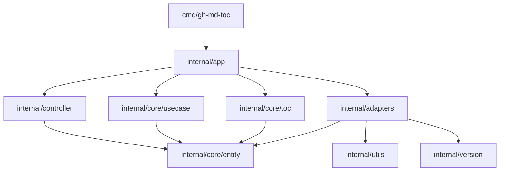
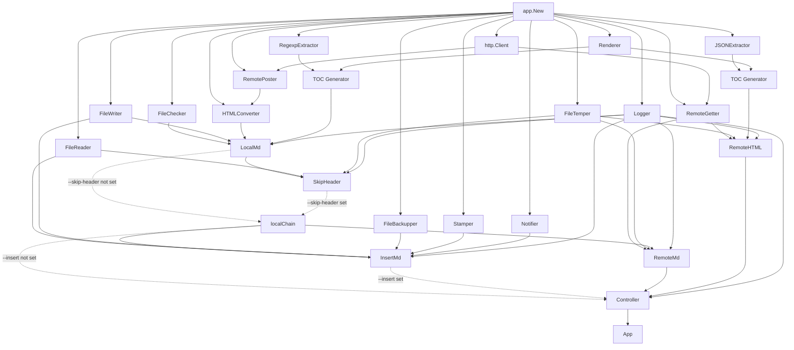

# Architecture

## Overview

`gh-md-toc` is a command-line application that generates a Markdown table of contents for local Markdown files, remote raw Markdown files, and GitHub document pages.

The project uses explicit dependency injection and package boundaries instead of inheritance. Go does not have classes, so the hierarchy below describes packages, structs, interfaces, ownership, and runtime calls.

The main architectural layers are:

1. `cmd/gh-md-toc` parses CLI options and starts the application.
2. `internal/app` is the composition root and presentation boundary.
3. `internal/controller` selects use cases, coordinates concurrency, and prints results.
4. `internal/core/usecase` implements document-processing workflows.
5. `internal/core/toc` contains the shared TOC generation rules.
6. `internal/core/entity` contains the core data types.
7. `internal/adapters` implements file, HTTP, GitHub, parsing, and logging operations.

## Clean and hexagonal architecture

The project is implemented in the style of Clean Architecture and hexagonal architecture. Business and application rules are kept separate from CLI, filesystem, HTTP, and GitHub-specific infrastructure.

The architectural roles are:

- `internal/core/entity`, `internal/core/toc`, and `internal/core/usecase` form the application core;
- `cmd/gh-md-toc` and `internal/controller` form the driving side that receives CLI input and invokes use cases;
- `internal/adapters` contains driven adapters for filesystem, HTTP, GitHub conversion and parsing, and logging;
- small interfaces declared by consumers act as ports between core workflows and concrete adapters;
- `internal/app` is the composition root that selects implementations and connects ports to adapters.

Dependencies point toward application rules. Core packages do not import CLI, controller, or adapter packages. Infrastructure details can therefore be replaced in tests or changed without moving their behavior into the core.

## Package hierarchy

```text
cmd/gh-md-toc
└── CLI parsing and process lifecycle
    └── internal/app
        ├── configuration and presentation
        ├── dependency construction
        ├── internal/controller
        │   └── input routing, concurrency, and result output
        ├── internal/core/usecase
        │   ├── localmd
        │   ├── skipheader (wraps localmd, only when --skip-header is set)
        │   ├── insertmd (wraps localChain, only when --insert is set)
        │   ├── remotemd (wraps localChain unconditionally)
        │   └── remotehtml
        ├── internal/core/toc
        │   ├── Generator
        │   └── Renderer
        └── internal/adapters
            ├── filesystem adapters
            ├── HTTP adapters
            ├── GitHub HTML and JSON extractors
            └── logger

internal/core/entity
├── Heading
├── Toc
├── Type
└── MarkerStart / MarkerEnd

internal/core/mdsplit
└── Split (cuts a document into chunks the GitHub Markdown API accepts)
```

## Dependency direction

The composition root knows all concrete implementations. Lower-level packages depend only on core types, standard library types, and small interfaces declared by their consumers.



Important dependency rules:

- `internal/core` does not import `internal/app`, `internal/controller`, or `internal/adapters`.
- `internal/controller` does not import concrete use case packages. It accepts the local `useCase` interface.
- use cases do not import concrete adapters. Each use case declares the interfaces it consumes.
- adapters do not own core workflow interfaces. They satisfy consumer interfaces implicitly.
- `internal/app` is allowed to import all application packages because it constructs the runtime object graph.

## Runtime object graph

`app.New` creates and connects the application objects. Shared instances are created once and passed to all consumers that need them.



The shared `http.Client` gives all remote operations the same timeout configuration. The shared `Renderer` gives both extraction paths the same TOC formatting behavior.

`app.New` always builds the plain `LocalMd`. When `cfg.SkipHeader` is true, it wraps
`LocalMd` in `SkipHeader`; either way, the result is assigned to the local variable
`localChain`. `LocalMd` and `SkipHeader` both satisfy the `markdownProcessor`
interface (`Do` and `DoAs`), so every consumer further down the chain works with
`localChain` without caring which of the two it actually holds.

`InsertMd` wraps `localChain`, it does not replace it: `app.New` only builds
`InsertMd` around `localChain` when `cfg.Insert.Enabled` is true. The controller then
receives whichever of the two implements the local-file use case for that run.
`RemoteMd` always keeps a direct reference to `localChain`, never to `InsertMd`,
because it processes a downloaded temporary file and must never have a TOC written
back into it. `--skip-header` still applies to `RemoteMd`'s downloaded document
through `localChain`; only the temp-file-into-`InsertMd` combination is disallowed.

## Main types and responsibilities

| Package | Type | Responsibility |
|---|---|---|
| `internal/app` | `App` | Runs presentation logic before and after controller processing, and warns about remote inputs when `--insert` is set. |
| `internal/app` | `Config` | Holds execution, presentation, GitHub, TOC, and insert settings. |
| `internal/app` | `PresentationConfig` | Controls header and footer visibility. |
| `internal/app` | `GitHubConfig` | Holds the GitHub token, API URL, and regexp layout version. |
| `internal/app` | `InsertConfig` | Controls whether the TOC is written into the source document and whether a backup is kept. |
| `internal/controller` | `Controller` | Selects a use case, runs document jobs, preserves output order, and aggregates errors. |
| `internal/core/usecase/localmd` | `LocalMd` | Validates a local file, converts Markdown through GitHub, and generates a TOC from returned HTML. |
| `internal/core/usecase/skipheader` | `SkipHeader` | Wraps `LocalMd` (or another `markdownProcessor`), cutting everything up to and including `<!--te-->` into a temporary file before delegating. |
| `internal/core/usecase/insertmd` | `InsertMd` | Wraps `localChain` (`LocalMd`, optionally wrapped by `SkipHeader`), then backs up and rewrites the block between the TOC markers in the source file. |
| `internal/core/usecase/remotemd` | `RemoteMd` | Downloads raw Markdown to a temporary file and delegates processing to `localChain`. |
| `internal/core/usecase/remotehtml` | `RemoteHTML` | Downloads GitHub JSON data and generates a TOC through the JSON path. |
| `internal/core/toc` | `Generator` | Combines a heading extractor with the shared renderer. |
| `internal/core/toc` | `Renderer` | Applies depth, indentation, escaping, and link rules to headings. |
| `internal/core/entity` | `Heading` | Represents a parsed heading before Markdown rendering. |
| `internal/core/entity` | `Toc` | Represents the generated TOC as Markdown lines and prints it. |
| `internal/core/entity` | `Type` | Classifies an input as local Markdown, remote raw Markdown, or remote HTML. |
| `internal/core/entity` | `MarkerStart` / `MarkerEnd` | The `<!--ts-->` / `<!--te-->` marker strings that delimit the TOC block inside a document. |
| `internal/adapters` | `HTMLConverter` | Sends local Markdown to the GitHub Markdown API. |
| `internal/adapters` | `RemotePoster` | Sends a file through the configured HTTP client. |
| `internal/adapters` | `RemoteGetter` | Downloads remote content through the configured HTTP client. |
| `internal/adapters` | `RegexpExtractor` | Extracts headings from GitHub-rendered HTML. |
| `internal/adapters` | `JSONExtractor` | Extracts headings from a GitHub JSON response. |
| `internal/adapters` | `FileChecker` | Checks whether a local file exists. |
| `internal/adapters` | `FileWriter` | Writes debug content to a file; also writes the rewritten document atomically for `InsertMd`. |
| `internal/adapters` | `FileReader` | Reads a whole file into memory, for `InsertMd` to locate the markers. |
| `internal/adapters` | `FileBackupper` | Copies a file to `<file>.orig.<timestamp>` before `InsertMd` rewrites it. |
| `internal/adapters` | `Stamper` | Builds the signature comment recording who ran the insert and when. |
| `internal/adapters` | `Notifier` | Writes status messages, such as the backup path or a non-local-input warning, to stderr. |
| `internal/adapters` | `FileTemper` | Creates and removes temporary files. |
| `internal/adapters` | `Logger` | Enables structured logging only in debug mode. |

## Interface relationships

Interfaces are intentionally small and located next to the consuming code.

| Consumer | Interface | Implemented by |
|---|---|---|
| `app.App` | `app.Controller` | `*controller.Controller` |
| `app.App` | `app.useCase` (used by `app.New`, not stored on `App`) | `*localmd.LocalMd`, `*skipheader.SkipHeader`, `*insertmd.InsertMd` |
| `app.App` | `app.markdownProcessor` (used by `app.New` to type `localChain`) | `*localmd.LocalMd`, `*skipheader.SkipHeader` |
| `app.App` | `app.notifier` | `*adapters.Notifier` |
| `controller.Controller` | `controller.useCase` | `*localmd.LocalMd`, `*skipheader.SkipHeader`, `*insertmd.InsertMd`, `*remotemd.RemoteMd`, `*remotehtml.RemoteHTML` |
| `controller.Controller` | `controller.logger` | `*adapters.Logger` |
| `localmd.LocalMd` | `localmd.fileChecker` | `*adapters.FileChecker` |
| `localmd.LocalMd` | `localmd.fileWriter` | `*adapters.FileWriter` |
| `localmd.LocalMd` | `localmd.htmlConverter` | `*adapters.HTMLConverter` |
| `localmd.LocalMd` | `localmd.tocGrabber` | `*toc.Generator` |
| `localmd.LocalMd` | `localmd.logger` | `*adapters.Logger` |
| `skipheader.SkipHeader` | `skipheader.markdownProcessor` | `*localmd.LocalMd` |
| `skipheader.SkipHeader` | `skipheader.fileReader` | `*adapters.FileReader` |
| `skipheader.SkipHeader` | `skipheader.fileTemper` | `*adapters.FileTemper` |
| `skipheader.SkipHeader` | `skipheader.logger` | `*adapters.Logger` |
| `insertmd.InsertMd` | `insertmd.useCase` | `*localmd.LocalMd`, `*skipheader.SkipHeader` (whichever `localChain` holds) |
| `insertmd.InsertMd` | `insertmd.fileReader` | `*adapters.FileReader` |
| `insertmd.InsertMd` | `insertmd.atomicWriter` | `*adapters.FileWriter` |
| `insertmd.InsertMd` | `insertmd.fileBackupper` | `*adapters.FileBackupper` |
| `insertmd.InsertMd` | `insertmd.stamper` | `*adapters.Stamper` |
| `insertmd.InsertMd` | `insertmd.notifier` | `*adapters.Notifier` |
| `insertmd.InsertMd` | `insertmd.logger` | `*adapters.Logger` |
| `remotemd.RemoteMd` | `remotemd.remoteGetter` | `*adapters.RemoteGetter` |
| `remotemd.RemoteMd` | `remotemd.markdownProcessor` | `*localmd.LocalMd` or `*skipheader.SkipHeader` (always `localChain`, never `*insertmd.InsertMd`) |
| `remotemd.RemoteMd` | `remotemd.fileTemper` | `*adapters.FileTemper` |
| `remotemd.RemoteMd` | `remotemd.logger` | `*adapters.Logger` |
| `remotehtml.RemoteHTML` | `remotehtml.remoteGetter` | `*adapters.RemoteGetter` |
| `remotehtml.RemoteHTML` | `remotehtml.tocGrabber` | `*toc.Generator` |
| `remotehtml.RemoteHTML` | `remotehtml.fileTemper` | `*adapters.FileTemper` |
| `remotehtml.RemoteHTML` | `remotehtml.logger` | `*adapters.Logger` |
| `toc.Generator` | `toc.HeadingExtractor` | `*adapters.RegexpExtractor`, `*adapters.JSONExtractor` |
| `adapters.HTMLConverter` | `adapters.remotePoster` | `*adapters.RemotePoster` |

These interfaces allow unit tests to replace each dependency with a small stub without requiring a shared ports package.

## Configuration hierarchy

```text
app.Config
├── Files []string
├── Serial bool
├── SkipHeader bool
├── Debug bool
├── Presentation app.PresentationConfig
│   ├── HideHeader bool
│   └── HideFooter bool
├── GitHub app.GitHubConfig
│   ├── GHToken string
│   ├── GHUrl string
│   └── GHVersion string
├── TOC toc.Config
│   ├── AbsolutePaths bool
│   ├── StartDepth int
│   ├── Depth int
│   ├── Escape bool
│   └── Indent int
└── Insert app.InsertConfig
    ├── Enabled bool
    └── NoBackup bool
```

`cmd/gh-md-toc` maps flags and environment variables into this structure. `app.New` derives `TOC.AbsolutePaths` from whether the CLI received multiple file arguments, matching bash `gh-md-toc`, which drops the prefix when a single document is requested. `InsertMd` overrides this per document rather than per run: it asks its inner use case for a TOC rendered against an empty display path, so a TOC written into a document links to itself with bare anchors, since GitHub resolves relative links against that document's own directory. Documents that are not inserted into, such as a remote URL passed in the same run, keep their prefix.

`SkipHeader` selects whether `app.New` wraps `LocalMd` in `SkipHeader` before
assigning the result to `localChain`; it takes no other parameters, since the
`<!--te-->` marker itself is the only input the use case needs.

Only the settings required at runtime are passed further:

- controller receives `Files` and `Serial`;
- `LocalMd` and `RemoteHTML` receive `Debug`;
- `SkipHeader` and `RemoteMd` receive no configuration beyond the collaborators they
  are built with;
- `Renderer` receives `toc.Config`;
- GitHub settings are used when constructing `HTMLConverter` and `RegexpExtractor`;
- `InsertMd` receives `Insert.NoBackup` and `Presentation.HideFooter`; `app.Run` reads
  `Insert.Enabled` directly to decide whether to warn about non-local inputs.

## Input routing

`entity.GetType` selects a processing path from the input string:

| Condition | Type | Use case |
|---|---|---|
| URL parsing fails or the input has no URL scheme | `TypeLocalMD` | `LocalMd` |
| Input contains `githubusercontent.com` | `TypeRemoteMD` | `RemoteMd` |
| Remaining URL | `TypeRemoteHTML` | `RemoteHTML` |

Standard input is copied to a temporary local file and then processed through the same `LocalMd` path.

## Processing flows

### Local Markdown

```text
Controller
  -> LocalMd.Do
  -> FileChecker.Exists
  -> HTMLConverter.Convert
  -> RemotePoster.Post          (documents up to 384 KB)
  -> mdsplit.Split              (larger documents)
  -> RemotePoster.PostBody      (once per chunk)
  -> GitHub /markdown/raw API
  -> RegexpExtractor.Extract    (once per chunk)
  -> Renderer.Render
  -> entity.Toc
```

When debug mode is enabled, `LocalMd` writes the returned HTML to `<input>.debug.html` through `FileWriter`.

`HTMLConverter.Convert` returns one HTML string per request. A document larger than
384 KB is cut by `mdsplit` at blank lines outside fenced code blocks, HTML comments
and raw HTML blocks, so every chunk parses the way those lines parse inside the whole
document; a chunk forced to end inside such a block closes it and reopens it in the
next chunk. `Generator.Grab` then extracts headings from every chunk and renumbers
duplicate anchors against a document-wide counter, because GitHub numbered duplicates
inside each chunk in isolation.

### Skip header (`--skip-header`)

```text
Controller (or InsertMd, if --insert is also set)
  -> SkipHeader.Do / DoAs
  -> FileReader.Read
  -> trim everything up to and including <!--te-->
  -> FileTemper.CreateTemp
  -> write the trimmed copy
  -> LocalMd.DoAs (builds the TOC from the trimmed copy, as above)
  -> FileTemper.Remove
  -> entity.Toc
```

`SkipHeader` wraps `LocalMd` rather than replacing it: it reads the source file,
drops every line up to and including the `<!--te-->` marker, and writes what remains
to a temporary file. It then delegates to `LocalMd.DoAs` with the temporary file as
the path to read and the *original* file as the display path, so rendered links still
point at the source document. If the source file has no `<!--te-->` marker, `SkipHeader`
skips the trimming and delegates to the inner use case with the original file
unchanged. The temporary file is always removed afterward, whether or not the inner
call succeeded.

`app.New` only builds `SkipHeader` when `cfg.SkipHeader` is true; otherwise
`localChain` is the plain `LocalMd`. Because `SkipHeader` implements the same
`markdownProcessor` interface as `LocalMd` (`Do` and `DoAs`), every consumer that
holds `localChain` - `InsertMd` and `RemoteMd` - works identically regardless of
which one it is.

### Insert into the source file (`--insert`)

```text
Controller
  -> InsertMd.Do
  -> localChain.Do (builds the TOC; may go through SkipHeader first, as above)
  -> FileReader.Read
  -> replaceBetweenMarkers (validate and rewrite the <!--ts--> / <!--te--> block)
  -> FileBackupper.Backup      (skipped when --no-backup is set)
  -> FileWriter.WriteAtomic
  -> Notifier.Notify
  -> entity.Toc
```

`InsertMd` wraps `localChain` rather than replacing it: it delegates to
`localChain.Do` to obtain the TOC, then reads the *current, untrimmed* file,
validates that it has exactly one `<!--ts-->` / `<!--te-->` marker pair in order, and
rewrites only the block between them, byte for byte outside that block. This is what
makes `--insert --skip-header` correct together: the TOC is built from the content
after the existing block (because `localChain` trimmed it away before building the
TOC), while the rewrite step still sees, and correctly replaces, the existing block
in the real file. The backup step runs before the rewrite so a failed rewrite still
leaves a pristine copy on disk; it is skipped when `Insert.NoBackup` is set.
`FileWriter.WriteAtomic` writes through a temporary file in the same directory and
renames it over the target, so a failed write cannot truncate the original.
`Notifier` reports the backup path and the rewritten path on stderr, separate from
the TOC printed to stdout.

`app.New` only builds `InsertMd` when `cfg.Insert.Enabled` is true; otherwise the
controller receives the plain `localChain` for local files, unchanged from before
`InsertMd` existed. `RemoteMd` is wired with `localChain` unconditionally, never with
`InsertMd`, so downloading a remote document and then applying `--insert` to it never
happens - the temporary file `RemoteMd` creates cannot be the target of a rewrite.
`app.Run` warns on stderr, once per input, about any file passed alongside `--insert`
that is not `entity.TypeLocalMD`, and otherwise leaves the document unmodified.

### Remote raw Markdown

```text
Controller
  -> RemoteMd.Do
  -> RemoteGetter.Get
  -> FileTemper.CreateTemp
  -> write downloaded Markdown
  -> localChain.DoAs
  -> remove temporary file
  -> entity.Toc
```

`RemoteMd` reuses the complete local Markdown workflow after downloading the document. It validates the response media type as `text/plain` before creating the temporary file. It calls `localChain.DoAs` with the temporary file path and the original URL as the display path, so rendered links point at the source document instead of the temporary file. When `--skip-header` is set, `localChain` is `SkipHeader`, so the downloaded document is trimmed the same way a local file would be - skipping a header in a downloaded document is correct, since the document itself is never rewritten.

### GitHub document page

```text
Controller
  -> RemoteHTML.Do
  -> RemoteGetter.Get
  -> JSONExtractor.Extract
  -> Renderer.Render
  -> entity.Toc
```

`RemoteHTML` expects an `application/json` response. When debug mode is enabled, it stores the downloaded response in a temporary `.debug.json` file.

## TOC generation

Parsing and rendering are separate responsibilities:

```text
external representation
  -> HeadingExtractor
  -> []entity.Heading
  -> Renderer
  -> entity.Toc
```

The extractors only understand their external formats:

- `RegexpExtractor` parses GitHub-rendered HTML;
- `JSONExtractor` parses GitHub JSON data.

`Renderer` is the single implementation of TOC formatting rules:

- start-depth filtering;
- maximum-depth filtering;
- indentation;
- special-character escaping;
- relative or absolute links;
- Markdown list formatting.

Both extraction paths use the same `Renderer` instance, which prevents formatting behavior from diverging. Because that instance is shared by the worker pool, the document path is passed into `Renderer.Render` and `Generator.Grab` as a call parameter rather than stored as renderer state.

## Concurrency and output ordering

`Controller.ProcessFiles` uses a bounded worker pool:

- parallel mode starts at most eight workers;
- serial mode starts one worker;
- every input receives its original index;
- workers may complete in any order;
- results are stored by index and printed in CLI argument order.

Errors from individual inputs are collected with `errors.Join` after all started work finishes. Successful TOCs are still printed. If any input fails, `App.Run` returns the combined error and does not print the footer.

## Context and resource lifecycle

The root context is created in `cmd/gh-md-toc` with `signal.NotifyContext`. It flows through app, controller, use cases, adapters, and TOC generation.

Context cancellation is checked before work and is attached to HTTP requests through `http.NewRequestWithContext`.

Resource ownership is local to the component that creates the resource:

- `HttpPost` closes the opened request file;
- HTTP helpers close response bodies;
- `RemoteMd` closes and removes its temporary Markdown file;
- `RemoteHTML` closes debug files and removes incomplete artifacts after errors;
- controller closes and removes the temporary stdin file.

Errors are wrapped with the operation and document path as they move outward. The CLI prints the final error to stderr and returns a nonzero exit code.

## Architectural principles

### Composition in one place

`app.New` constructs the concrete dependency graph. Core workflows do not create adapters themselves.

### Consumer-owned interfaces

Each package declares only the methods it needs. Concrete implementations satisfy those contracts implicitly.

### External concerns stay in adapters

Filesystem access, HTTP requests, GitHub response parsing, and logging are implemented in `internal/adapters`.

### Core formatting stays format-independent

Extractors produce `entity.Heading` values. The renderer does not know whether headings came from HTML or JSON.

### Presentation stays at the application boundary

Header and footer formatting is owned by `internal/app`. Use cases return data and errors without writing presentation text.

### Observable behavior is shared

Serial and parallel processing use the same result path, and JSON and regexp extraction use the same renderer.
